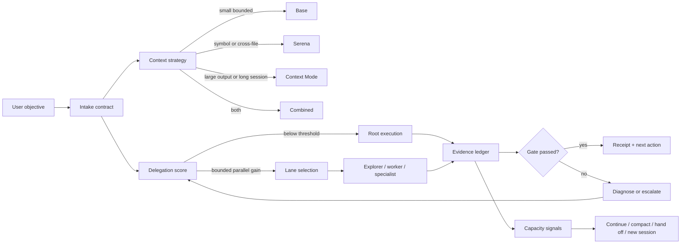

# Architecture

YGT Harness Router is a small policy layer around native Codex execution. It
does not replace Codex's model, sandbox, marketplace, or billing systems.

## Control flow

## Intake contract

Every non-trivial task should have:

- **Objective:** what outcome is requested.
- **Done:** an observable result and the command or readback that proves it.
- **Scope:** files, services, or records that may be inspected or changed.
- **Forbidden outcomes:** destructive operations, secret exposure, unrelated
  edits, or claims that cannot be evidenced.
- **Stop condition:** when the lane must return instead of exploring further.

Cheap intake is intentional. Do not spend a full reasoning turn classifying a
one-line command.

The pre-session launcher is the enforcement point. A prompt arriving inside an
already-open Sol session cannot retroactively become a direct Luna session.
`scripts/route_exec.py` therefore performs deterministic local intake before
`codex exec`, passes the prompt on stdin, and opens exactly one routed process.

IDE extensions use the equivalent pre-inference boundary:
`codex_entry_router.py` proxies app-server JSONL and rewrites only `turn/start`
`model`/`effort` fields from user text. The native app-server remains protocol
owner; the proxy makes no model call, network call, or prompt persistence.

CLI `exec` has a wider pre-session boundary. It also applies sandbox, native
multi-agent availability, verbosity, approval, and context-profile overrides.
The IDE app-server enables native multi-agent capability process-wide, while MCP
selection stays static because the server has already started before a turn.

## Context strategy

Context tooling is selected independently from model and delegation. Serena is a
symbol-retrieval layer; Context Mode is a large-output/session-continuity layer.
Neither is free at startup, so the router returns `base`, `serena`,
`context-mode`, or `context-lab` before a session begins. Hooks must not attempt
late bypass because MCP and `SessionStart` cost has already been paid.

The discovery benchmark in `docs/context-routing-benchmark.md` makes base the
default for proven small tasks. Unknown tasks retain the combined quality-first
route until intake supplies enough bounded signals.

## Delegation score

The score is a routing aid with six dimensions:

| Dimension | Question |
| --- | --- |
| Clarity | Can a child start without guessing the target or contract? |
| Parallel gain | Is there independent work that can run at the same time? |
| Verification | Will a second lane produce meaningful challenge or evidence? |
| Handoff | Can the output be represented as a compact, durable receipt? |
| Uncertainty | Is discovery or conflict resolution the dominant work? |
| Reasoning | Does the task need architecture, security, or high-depth analysis? |

High score does not mean “spawn as many agents as possible.” Thread and depth
limits are part of the contract. A low score should stay local to avoid paying
handoff and context overhead.

## Execution lanes

Deployments may name lanes differently, but the intended separation is:

- **Explorer:** read-only inventory, extraction, and evidence gathering.
- **Worker:** normal implementation inside an explicit file and test scope.
- **Specialist:** ambiguous, architecture-sensitive, security-sensitive, or
  failed-gate work.

Each lane should declare its model, reasoning effort, sandbox, runtime, and
allowed scope. The lane returns a structured receipt; the parent owns
integration and final verification.

## Evidence ledger

The ledger records observations, not hidden reasoning:

- command, tool, or test name;
- exit status and relevant output summary;
- changed paths and current diff state;
- model/effort/lane metadata when available;
- gate status and unresolved blockers;
- child receipt and whether the parent consumed it.

The same ledger can power a local dashboard or OpenTelemetry exporter. It is not
an invoice and should not include raw secrets or prompt content by default.

## Capacity decisions

The router treats context as a capacity budget. At a phase boundary it may:

1. continue when the current context is still useful;
2. compact into a durable handoff when the next phase can start from a summary;
3. hand off to a fresh child when ownership and scope are clear; or
4. start a new session when the current context is polluted, stale, or unsafe.

Compaction is a measurement point, not automatically an optimization. Compare
the compacted context with post-compact rereads and gate outcomes before making
the threshold global.

## Failure and escalation

The router should diagnose ordinary failures and retry a read-only transient
operation at most within its configured policy. A failed lower-level test blocks
the next validation layer. An unresolved exact target, destructive request, or
secret boundary is an explicit stop/escalation—not a reason to substitute a
nearby target.

## Extension boundaries

The plugin can integrate with:

- native Codex custom agents;
- native command hooks (`PreToolUse`, `PostToolUse`, `PreCompact`,
  `PostCompact`, `SubagentStart`, and `SubagentStop`) when supported by the
  installed CLI;
- optional OpenTelemetry exporters; and
- repository-local scripts or skills.

Extensions must preserve the same receipt, privacy, and evidence contract. A
hook that changes behavior without recording an observable event is harder to
debug than the work it is meant to improve.
